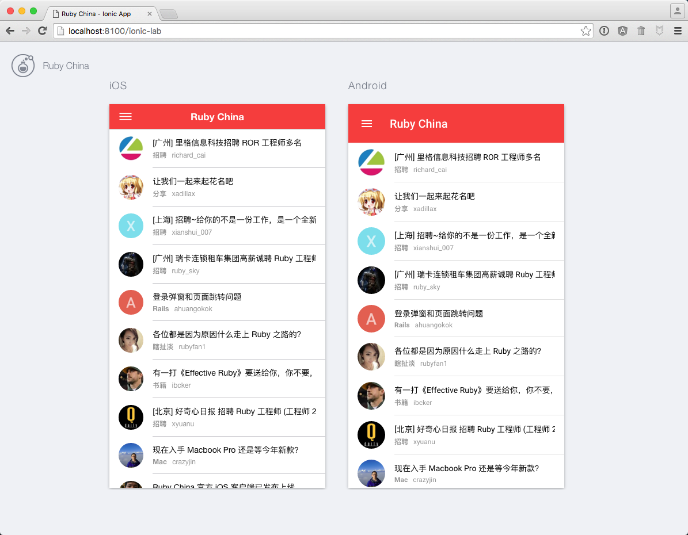

## Ruby China App using Ionic2

尝试使用 Ionic2 来重构 Ruby China App 现有版本，Ionic2 带来了全新的开发过程体验。这意味着需要尝试使用目前最新的 Angular2 beta 以及 TypeScript / ES6 等相关技术，对于了解前端技术和实践有一定的意义。当然，由于以上的相关技术仍在不断地演化过程中，随时会调整部分方法、逻辑甚至结构，因此，目前本项目将作为 **实验性项目** 主要用于学习和实践。

### 安装 Installation

本项目需要按以下步骤运行：  
1）安装 Ionic2
`$ npm install -g ionic@beta`

2）安装项目组件  
在项目根目录下 `$ npm install`

3）运行项目  
`$ ionic serve`
> 运行时添加 -l 参数可以浏览 iOS / Android 双屏结果 `$ ionic serve -l`

### Chrome 运行效果

