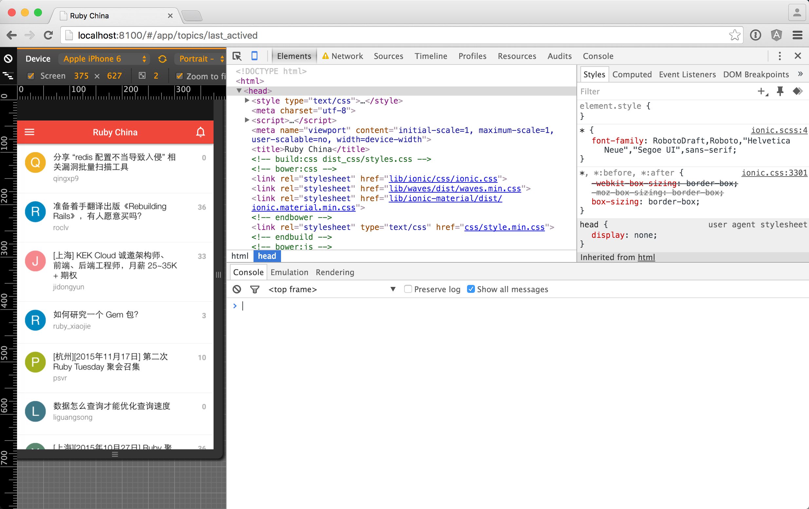
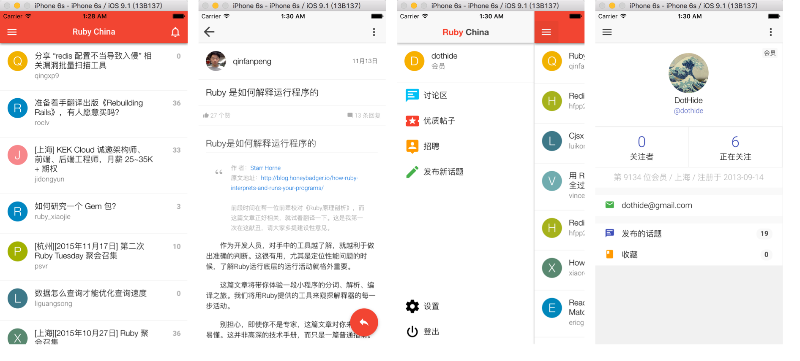

# Ruby China App
这是 Ruby China 使用 Ionic 框架开发的适用于 iOS 和 Android 两个平台客户端 APP。

🚀 **根据 Johnpapa's AngularJS Style 重构了上一版，根据设计稿重画界面（加入了 Material 元素）**
⏳ **此外还加入了 Gulp 自动化部署脚本，使得开发更顺畅，使得部署生产软件精简包更便捷！**
🚿 **全新的视觉体验 + 全新的开发体验，让你更从容地面对前端应用开发！**

## 第一版的主要功能（已完成度）
1. 用户登陆、退出（100%）
2. 帖子列表（100%）
3. 帖子详情（100%）
4. 发表新帖（100%）
5. 回复帖子（100%）
6. 我的主页（100%）
7. 个人资料（0%）
8. 我的帖子（0%）
9. 我的收藏（0%）
10. 通知提醒（0%）
11. 设置（0%）

## 安装 (Installation)
在运行程序前，你需要首先安装 NodeJS 以及 Ionic
- NodeJS 安装请移步：[Install NodeJS](https://nodejs.org/en/)
- Ionic 安装请移步：[Install Ionic](http://ionicframework.com/getting-started/)

进入项目根目录执行：`$ npm install && bower install`
添加 iOS 工程 `$ cordova platform add ios`
添加 Android 工程 `$ cordova platform add android`

## 开发（Development）
在开发程序时，请使用 `$ foreman start` 打开开发服务器，并使用 Chrome 作为调试工具
- 使用 `bower install ***` 安装组件时，最好加上 `--save` 参数。如果此时开发服务器正打开着，Gulp会自动将组件文件引用至 `index.html`
如果没有打开开发服务器时，可以运行 `$ gulp` 自动部署文件
- 使用 `npm install ***` 安装组件时，最好加上 `--save-dev` 参数。
- 完成开发时，需要部署到iOS，先运行 `$ gulp useref` 生成本地 dist 目录，然后再运行 `$ ionic build ios` 生成 iOS 工程（暂时只支持iOS）

## 在 Chrome 里运行
项目下载后（并已安装 Ionic）可以先在 Chrome 里运行查看效果
在终端中运行 `$ foreman start` ，然后打开 Chrome 并输入： `http://localhost:8100` 访问

打开后效果如下：
> 此时可以自行选择设备查看

## 在 Xcode 中运行
如果能在 Chrome 中顺利看到效果后，可以在终端输入以下命令，使项目能在 Xcode 中运行：

1. 首先，运行 `$ ionic platform add ios` (添加 iOS 平台支持)
2. 然后，运行 `$ ionic build ios` (编译生成项目)
3. 最后，运行 `$ ionic emulate ios` (在模拟器中运行程序) 或者 打开 `platforms/ios/Ruby China App.xcodeproj` 运行 Xcode，并在 Xcode 中运行项目

运行效果如下：

## 在 Android 平台运行
暂时还未安装安卓平台软件，如果有朋友运行起来可以截图发给我
