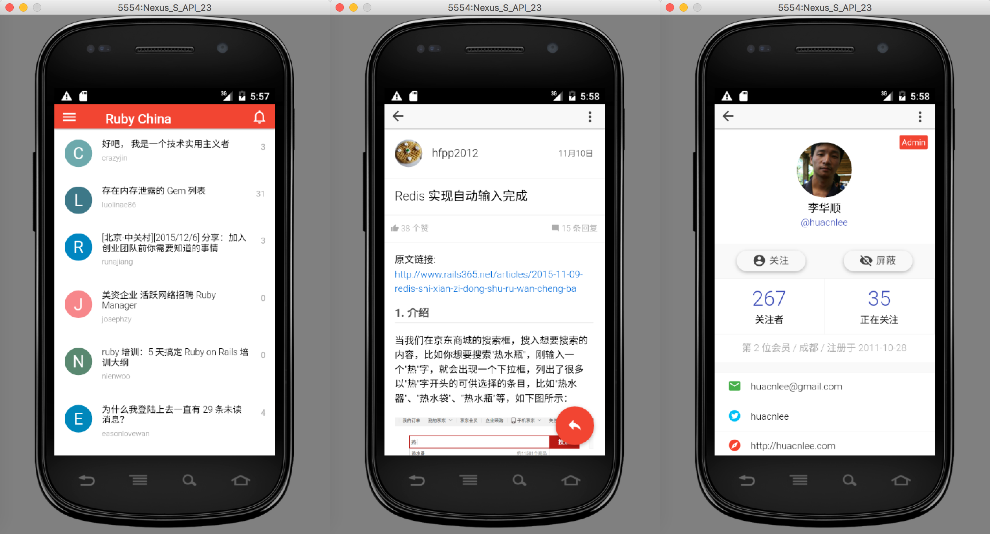

# Ruby China App
Official Ruby China Mobile App for iOS and Android using Ionic framework.

[](https://itunes.apple.com/cn/app/ruby-china-guan-fang-ke-hu-duan/id1072028763?mt=8)

🚀 **An refactor version according to Johnpapa's AngularJS Style, and redraw UI with Material elements**  
⏳ **Additional, adding Gulp make it easy to build**  
🚿 **New UI + New DE make it more fun to play Front-end Development**

## The 1st Major Release (Progress)
1. User Login / Logout（100%）
2. Topic List（100%）
3. Topic Detail（100%）
4. New Topic（100%）
5. Reply（100%）
6. HomePage（100%）
7. Profile（0%）
8. My Topics（0%）
9. My Favorites（0%）
10. Push Notification（80%）
11. Settings（0%）

## Installation
It really need NodeJS & Ionic installed before you can play Our Project

* NodeJS following：[Install NodeJS](https://nodejs.org/en/)
* Ionic following：[Install Ionic](http://ionicframework.com/getting-started/)

```bash
# Enter project root folder and input：
$ npm install && bower install

# auto-generater dist/ folder
$ gulp useref

# Adding iOS Platform
$ ionic platform add ios

# Adding Android Platform
$ ionic platform add android
```

## Development
Use `$ foreman start` or `$ ionic serve -w chrome -a` to start Server
> cannot run foreman? run `$ gem install foreman` first.

Use `bower install *** --save` install Bower components
> If the dev server is running，Gulp will help you to adding all js dependency to `index.html`
> If not, run `$ gulp` to make it.

Use `npm install *** --save-dev` install npm modules


## Run in Chrome

Open your Chrome and locate: http://localhost:8100/
> Select device what you like

##### Screenshots


## Run in Xcode
Following these step, and you'll see it.

```bash
# 1. Adding iOS Support
$ ionic platform add ios 

# 2. Building
$ ionic build ios 

# 3. run it in your simulator
$ ionic emulate ios 
# another way, open Xcode first then run.
$ open platforms/ios/Ruby China App.xcodeproj
```

##### Screenshots


## Run in Android
Following these step, and you'll see it.

```bash
# 1. Adding Android Support
$ ionic platform add android

# 2. Download Android SDK & Simulator first
> Ref on Mac[Android Studio Installation](http://developer.android.com/sdk/installing/index.html?pkg=studio)

# 3. Everythings ok then build it
$ ionic build android

# 4. Open your simulator
$ ionic emulate android
```

##### Screenshots

